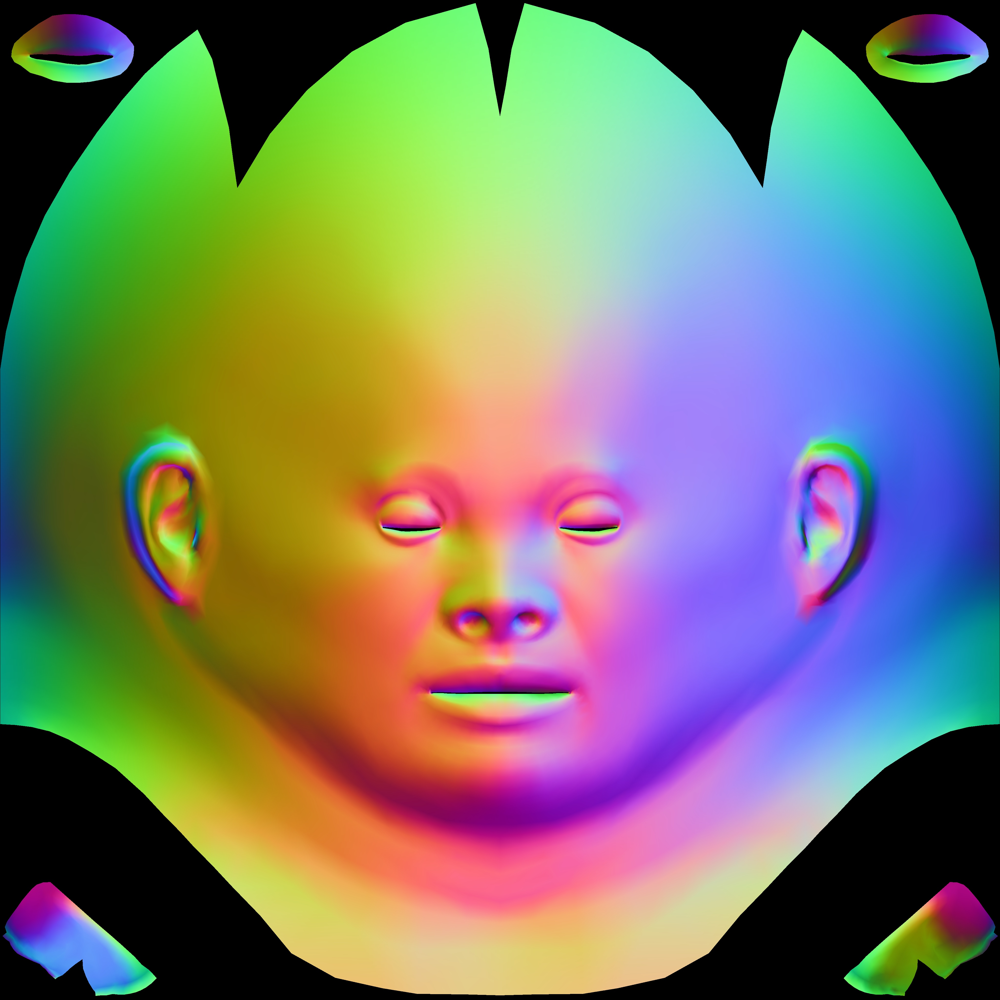

# Inverse Rendering Using Ceres
This project aims to recover the facial reflectance (diffuse albedo, specular albedo, roughness, displacement map) from single-shot multi-view images. 

### HDR environment map capture 

1. Capture a mirror sphere at several exposures to acquire an HDR light probe of the surrounding environment.
2. Estimate the position of the mirror sphere.
3. Compute the latitude-longitude environment map.

### Spherical harmonics estimation 

From left to right: environment map, 3 order spherial harmonics approximation.

### Median-cut to approximate the environment light

From left to right: environment map, 256 lights estimated using median-cut.

### Estimate detailed normal map from displacement map

From left to right: normal map from geometry, high-resolution normal map fusing displacement map.

### Render using cook-torrance brdf

From left to right: render facial image, diffuse component, specular component.

### Inverse Rendering Optimization

Using ceres to solve.

### Reference
1. Gotardo et al. Practical Dynamic Facial Appearance Modeling and Acquisition. ACM Transactions on Graphics. 2018.
2. Riviere et al. Single-Shot High-Quality Facial Geometry and Skin Appearance Capture. ACM Transactions on Graphics. 2020.

